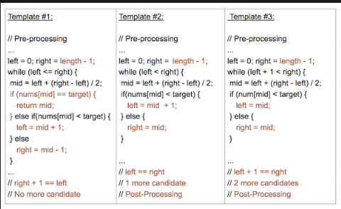

# 04 Binary Search

Binary search is a powerful algorithmic technique used to efficiently search for a target value in an ordered array. It takes advantage of the array's sorted nature to significantly reduce the search space with each iteration, making it an effective and commonly used algorithm.

Binary search excels with ordered arrays because it capitalizes on the ability to divide the search space in half at each step. This results in a time complexity of O(log N) for searching, which is a significant improvement compared to the linear time complexity of O(N) for other search methods like traversing the array sequentially. This is especially true for arrays with a large number of elements.

Binary search can be applied to solve more complex problems that require _finding multiple occurrences or specific patterns within a sorted array_. By carefully designing the search criteria and updating the search range, we can effectively navigate through the array and locate the desired elements.

## A Reliable Binary Search Template

When writing code for binary search, one common challenge is dealing with off-by-one errors. These errors arise when determining the iteration conditions and deciding which elements to eliminate at each step of the search.

A reliable template for binary search implementations:

```js
let left = 0
let right = array.length - 1
while (left <= right) {
  mid = Math.floor((left + right) / 2) // updating mid on each iteration
  if (array[mid] == target) {
    // Optional early return
  } else if (/*comparison*/) { // element should lay on the right side
    left = mid + 1
  } else {                     // element should lay on the left side
    right = mid - 1
  }
}

// Most often, if the target is not found, additional handling
// or returning a specific value is needed. In most cases it will
// be the value that `left` variable holds.
```

## Applications

Binary search can be applied to solve more complex problems that require finding multiple occurrences or specific patterns within a sorted array. By carefully designing the search criteria and updating the search range, we can effectively navigate through the array and locate the desired elements.

We can study two sample problems:

### First Problem

The first problem entails finding the insertion index for a given target element in a sorted array. By applying the binary search template, we dissect the step-by-step process required to efficiently locate the insertion index. This problem demonstrates how binary search can be employed not only to find an element but also to determine its position in a sorted array.

```js
// Write a function named findInsertPosition that takes in a
// sorted array of distinct integers and a target value as input.
// The function should return the index where the target value is
// found in the array, or the index where it would be inserted if
// it were not found.

// If the target value is found in the array, the function should
// return the index of the target value. If the target value is not found,
// the function should return the index where it would be inserted
// while maintaining the sorted order of the array.

// Example:
// Input: nums = [3, 5, 7, 9, 11], target = 9
// Output: 3

// Example:
// Input: nums = [3, 5, 7, 9, 11], target = 2
// Output: 0

function findInsertPosition(nums, target) {
  let left = 0;
  let right = nums.length - 1;
  while (left <= right) {
    mid = Math.floor((left + right) / 2);
    if (nums[mid] == target) {
      return mid;
    } else if (nums[mid] < target) {
      left = mid + 1;
    } else {
      right = mid - 1;
    }
  }
  return left;
}
```

### Second Problem

The second problem presents a more challenging scenario where we needed to find the starting and ending positions of a target element in a sorted array. To address this problem, we divide it into two separate binary searches: finding the leftmost position and finding the rightmost position. By conducting these searches independently, we successfully obtain the desired solution.

```js
// You are given a sorted array of integers in ascending order.
// Your task is to find the starting and ending positions of
// a given target value within the array.

// Implement a function findRange that takes in an array of integers
// nums and a target value target. The function should return an array
// containing the starting and ending positions of the target value
// within the array. If the target value is not found, return [-1, -1].

// Example:
// Input: nums = [1, 2, 3, 3, 3, 3, 3, 4, 5], target = 3
// Output: [2, 6]

// Example:
// Input: nums = [1, 2, 3, 3, 3, 5, 6,], target = 4
// Output: [-1, -1]

function findRange(nums, target) {
  return [findLeftMostIndex(nums, target), findRightMostIndex(nums, target)];
}

function findLeftMostIndex(nums, target) {
  let left = 0;
  let right = nums.length - 1;
  let currLeftMost = -1;
  while (left <= right) {
    mid = Math.floor((left + right) / 2);
    if (nums[mid] == target) {
      currLeftMost = mid;
      right = mid - 1;
    } else if (nums[mid] < target) {
      left = mid + 1;
    } else {
      right = mid - 1;
    }
  }
  return currLeftMost;
}

function findRightMostIndex(nums, target) {
  let left = 0;
  let right = nums.length - 1;
  let currRightMost = -1;
  while (left <= right) {
    mid = Math.floor((left + right) / 2);
    if (nums[mid] == target) {
      currRightMost = mid;
      left = mid + 1;
    } else if (nums[mid] < target) {
      left = mid + 1;
    } else {
      right = mid - 1;
    }
  }
  return currRightMost;
}
```

## LeetCode Binary Search Template Analysis

### Template Explanation:

99% of binary search problems that you see online will fall into 1 of these 3 templates. Some problems can be implemented using multiple templates, but as you practice more, you will notice that some templates are more suited for certain problems than others.

Note: The templates and their differences have been colored coded below.



These 3 templates differ by their:

- left, mid, right index assignments
- loop or recursive termination condition
- necessity of post-processing

Templates 1 and 3 are the most commonly used and almost all binary search problems can be easily implemented in one of them. Template 2 is a bit more advanced and used for certain types of problems.

Each of these 3 provided templates provides a specific use case:

### Template #1 (`left <= right`):

- Most basic and elementary form of Binary Search
- Search Condition can be determined without comparing to the element's neighbors (or use specific elements around it)
- No post-processing required because at each step, you are checking to see if the element has been found. If you reach the end, then you know the element is not found

### Template #2 (`left < right`):

- An advanced way to implement Binary Search.
- Search Condition needs to access the element's immediate right neighbor
- Use the element's right neighbor to determine if the condition is met and decide whether to go left or right
- Guarantees Search Space is at least 2 in size at each step
- Post-processing required. Loop/Recursion ends when you have 1 element left. Need to assess if the remaining element meets the condition.

### Template #3 (`left + 1 < right`):

- An alternative way to implement Binary Search
- Search Condition needs to access element's immediate left and right neighbors
- Use element's neighbors to determine if the condition is met and decide whether to go left or right
- Guarantees Search Space is at least 3 in size at each step
- Post-processing required. Loop/Recursion ends when you have 2 elements left. Need to assess if the remaining elements meet the condition.
